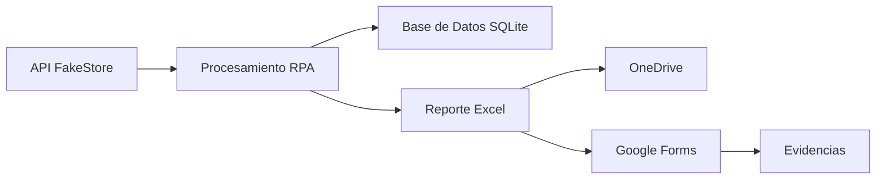
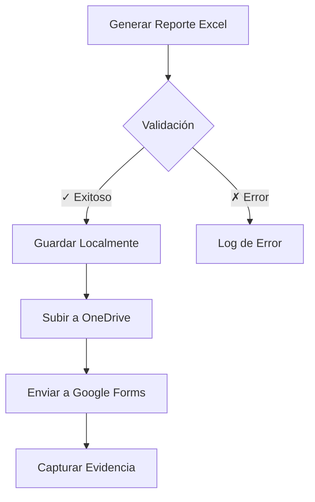

# 🧠 Prueba Técnica – Desarrollo RPA (PIX Robotics)

<div align="center">


**Automatización RPA para análisis y reporte de productos desde FakeStore API**

[Documentación](#-documentación) • [Instalación](#-instalación) • [Uso](#️-uso) • [Contacto](#-contacto)

</div>

---

## 📋 Información del Proyecto

| Campo | Detalle |
|-------|---------|
| **Autor** | José Fernando Figueredo Estupiñán |
| **Correo** | figueredoestupinanj37@gmail.com |
| **Fecha de Entrega** | Octubre 2025 |
| **Plataforma** | PIX Studio (conectado a PIX Master) |
| **Versión PIX** | v2.4 o superior |

---

## 🎯 Objetivo del Proyecto

Este proyecto implementa un proceso de **Automatización Robótica de Procesos (RPA)** utilizando **PIX Studio** para automatizar de manera integral el flujo de análisis y generación de reportes de productos desde una tienda en línea.

### Funcionalidades Principales



| # | Funcionalidad | Descripción |
|---|---------------|-------------|
| 1 | **Consumo de API** | Integración con FakeStore API para obtención de datos |
| 2 | **Persistencia de Datos** | Almacenamiento en base de datos SQLite local |
| 3 | **Generación de Reportes** | Creación automática de reportes Excel con estadísticas |
| 4 | **Integración Cloud** | Subida automática a OneDrive mediante Microsoft Graph API |
| 5 | **Automatización Web** | Envío automatizado de formularios en Google Forms |
| 6 | **Auditoría y Trazabilidad** | Sistema de logs y capturas de evidencias |

---

## ⚙️ Stack Tecnológico

<table>
<tr>
<td width="50%">

### Core Technologies
- **RPA Platform**: PIX Studio v2.4+
- **API Source**: [FakeStore API](https://fakestoreapi.com/products)
- **Database**: SQLite 3
- **Reporting**: Microsoft Excel (.xlsx)

</td>
<td width="50%">

### Integrations
- **Cloud Storage**: Microsoft Graph API (OneDrive)
- **Web Automation**: Google Forms
- **Data Formats**: JSON, SQL, XML
- **Logging**: Custom logging system

</td>
</tr>
</table>

---

## 🏗️ Arquitectura del Proyecto

```
prueba-tecnica-de-automatizacion-rpa-main/
│
├── 📁 prueba_tecnica/
│   │
│   ├── 📁 Framework/                    # Componentes modulares RPA
│   │   ├── ApiProductos.pix            # Consumo de API REST
│   │   ├── SaveToDatabase.pix          # Persistencia en SQLite
│   │   ├── GenerateExcelReport.pix     # Generación de reportes
│   │   ├── UploadToOneDrive.pix        # Integración con OneDrive
│   │   ├── SubmitWebForm.pix           # Automatización de formularios
│   │   ├── TakeScreenshot.pix          # Captura de evidencias
│   │   └── SetTransactionStatus.pix    # Control de transacciones
│   │
│   ├── 📁 Data/                         # Datos y configuraciones
│   │   ├── 📁 json/
│   │   │   └── Productos_YYYY-MM-DD.json
│   │   ├── 📁 Reportes/
│   │   │   └── Reporte_YYYY-MM-DD.xlsx
│   │   └── Config.xlsx
│   │
│   ├── 📁 Database/                     # Base de datos y scripts
│   │   ├── create_table_productos.sql
│   │   └── productos.db
│   │
│   ├── 📁 Evidencias/                   # Capturas y pruebas
│   │   └── formulario_confirmacion.png
│   │
│   └── 📁 Logs/                         # Registros de ejecución
│       └── run_YYYY-MM-DD.log
│
├── 📄 Main.pix                          # Orquestador principal
├── 📄 README.md                         # Documentación del proyecto
└── 📄 EVALUACION.MD                     # Criterios de evaluación
```

---

## 🚀 Instalación

### Requisitos del Sistema

- **Sistema Operativo**: Windows 10/11 (64-bit)
- **RAM**: Mínimo 4GB (recomendado 8GB)
- **Disco**: 500MB de espacio libre
- **Conectividad**: Conexión a internet estable

### Paso 1: Instalación de PIX Studio

```bash
# Descargar PIX Studio desde el sitio oficial
# URL: https://es.pixrobotics.com/download/
```

**Configuración de PIX Master:**

| Parámetro | Valor |
|-----------|-------|
| Servidor | `https://students.pixrobotics.org/` |
| Usuario | `Prueba_tecnica2025` |
| Contraseña | `Prueba_tecnica2025` |

### Paso 2: Instalación de SQLite (Opcional)

Para explorar la base de datos manualmente:

```bash
# Descargar DB Browser for SQLite
# URL: https://sqlitebrowser.org/
```

### Paso 3: Dependencias Externas

- ✅ Acceso a internet para consumo de API
- ✅ Credenciales válidas de **Microsoft Graph API**
- ✅ Cuenta de Google para automatización de formularios

---

## 🔐 Configuración de Microsoft Graph API

### Creación de App Registration en Azure

1. **Acceder a Azure Portal**
   - URL: [https://portal.azure.com](https://portal.azure.com)

2. **Crear una nueva App Registration**
   - Nombre: `RPA_Upload_App`
   - Tipo de cuenta: Cuentas en cualquier directorio organizacional

3. **Obtener credenciales**

   | Credencial | Ubicación |
   |------------|-----------|
   | Client ID | Overview → Application (client) ID |
   | Tenant ID | Overview → Directory (tenant) ID |
   | Client Secret | Certificates & secrets → New client secret |

4. **Asignar permisos API**

   ```
   Microsoft Graph API Permissions:
   ├── Files.ReadWrite.All (Application)
   ├── offline_access (Delegated)
   └── User.Read (Delegated)
   ```

5. **Configurar variables de entorno**

   Crear archivo `.env` en la raíz del proyecto:

   ```env
   # Microsoft Graph API Configuration
   GRAPH_CLIENT_ID=your_client_id_here
   GRAPH_TENANT_ID=your_tenant_id_here
   GRAPH_CLIENT_SECRET=your_client_secret_here
   GRAPH_SCOPE=https://graph.microsoft.com/.default
   GRAPH_UPLOAD_PATH=/RPA/Reportes/
   ```

   > ⚠️ **Importante**: Nunca subas el archivo `.env` a repositorios públicos

---

## 🗄️ Configuración de Base de Datos

### Creación de Tabla

Ejecutar el siguiente script SQL para inicializar la base de datos:

```sql
-- Archivo: prueba_tecnica/Database/create_table_productos.sql

-- =====================================================
-- Script de creación de tabla para la Prueba Técnica RPA
-- Autor: José Fernando Figueredo Estupiñán
-- Fecha: 2025-10-04
-- =====================================================

CREATE TABLE IF NOT EXISTS Productos (
    id INTEGER PRIMARY KEY,
    title TEXT NOT NULL,
    price REAL NOT NULL,
    category TEXT,
    description TEXT,
    fecha_insercion TIMESTAMP DEFAULT CURRENT_TIMESTAMP
);

-- Índices para optimización de consultas
CREATE INDEX IF NOT EXISTS idx_category ON Productos(category);
CREATE INDEX IF NOT EXISTS idx_fecha ON Productos(fecha_insercion);

-- =====================================================
-- Validaciones implementadas:
--   ✓ Clave primaria: evita duplicados por id
--   ✓ fecha_insercion: se completa automáticamente
--   ✓ Índices: mejoran el rendimiento de consultas
-- =====================================================
```

### Ejecución del Script

```bash
# Método 1: Usando SQLite CLI
sqlite3 prueba_tecnica/Database/productos.db < prueba_tecnica/Database/create_table_productos.sql

# Método 2: Usando DB Browser for SQLite
# 1. Abrir DB Browser
# 2. New Database → productos.db
# 3. Execute SQL → Pegar el script
# 4. Run
```

### Características de la Base de Datos

- **Prevención de duplicados**: Basada en el campo `id` (Primary Key)
- **Auditoría temporal**: Campo `fecha_insercion` con timestamp automático
- **Optimización**: Índices en campos de búsqueda frecuente

---

## 📈 Sistema de Reportes

### Generación Automática de Reportes Excel

El robot genera reportes con la siguiente nomenclatura:

```
Reporte_YYYY-MM-DD.xlsx
```

### Estructura del Reporte

<table>
<tr>
<td width="50%">

#### 📊 Hoja 1: Productos
- ID del producto
- Título
- Precio
- Categoría
- Descripción

</td>
<td width="50%">

#### 📈 Hoja 2: Resumen
- Total de productos
- Precio promedio general
- Precio promedio por categoría
- Cantidad por categoría
- Análisis estadístico

</td>
</tr>
</table>

### Flujo de Distribución



---

## 🌐 Automatización Web

### Envío de Formulario Google Forms

El robot completa automáticamente los siguientes campos:

| Campo | Tipo | Obligatorio |
|-------|------|-------------|
| Nombre del colaborador | Texto | ✓ |
| Fecha de generación | Fecha | ✓ |
| Comentarios | Texto largo | ✗ |
| Archivo Excel | File Upload | ✓ |

### Captura de Evidencias

Tras el envío exitoso, el sistema captura:

```
📸 /Evidencias/formulario_confirmacion_YYYY-MM-DD_HHmmss.png
```

**Contenido de la evidencia:**
- ✅ Mensaje de confirmación
- ✅ Timestamp de envío
- ✅ Datos enviados (resumen)

---

## 🪵 Sistema de Logs y Auditoría

### Estructura de Logs

```
/Logs/run_YYYY-MM-DD_HHmmss.log
```

### Niveles de Log

| Nivel | Icono | Descripción |
|-------|-------|-------------|
| `INFO` | ℹ️ | Información general de ejecución |
| `SUCCESS` | ✅ | Operación completada exitosamente |
| `WARNING` | ⚠️ | Advertencia, no crítica |
| `ERROR` | ❌ | Error en la ejecución |
| `CRITICAL` | 🔥 | Error crítico, detiene el proceso |

### Ejemplo de Log Completo

```log
=====================================================
  PIX RPA - Registro de Ejecución
  Proyecto: Prueba Técnica Desarrollo RPA
  Desarrollador: José Fernando Figueredo Estupiñán
  Fecha: 2025-10-04 10:33:02
  Versión: 1.0.0
=====================================================

[2025-10-04 10:33:02] INFO     - Iniciando proceso RPA principal
[2025-10-04 10:33:03] INFO     - Descargando datos desde API (https://fakestoreapi.com/products)
[2025-10-04 10:33:03] SUCCESS  - Conexión establecida correctamente (HTTP 200)
[2025-10-04 10:33:03] INFO     - 20 productos obtenidos
[2025-10-04 10:33:04] SUCCESS  - Guardando respaldo en JSON: /Data/json/Productos_2025-10-04.json
[2025-10-04 10:33:06] INFO     - Base de datos conectada (SQLite)
[2025-10-04 10:33:06] INFO     - Insertando productos nuevos (evitando duplicados)
[2025-10-04 10:33:07] SUCCESS  - Total insertados: 20 | Duplicados ignorados: 0
[2025-10-04 10:33:10] INFO     - Generando reporte Excel: Reporte_2025-10-04.xlsx
[2025-10-04 10:33:13] SUCCESS  - Hoja "Productos" y "Resumen" creadas correctamente
[2025-10-04 10:33:14] INFO     - Subiendo archivo a OneDrive: /RPA/Reportes/Reporte_2025-10-04.xlsx
[2025-10-04 10:33:15] SUCCESS  - Respuesta Graph API: 201 Created
[2025-10-04 10:33:20] INFO     - Accediendo a formulario web (Google Forms)
[2025-10-04 10:33:21] INFO     - Campos completados: Nombre, Fecha, Comentarios
[2025-10-04 10:33:22] SUCCESS  - Archivo Excel adjuntado
[2025-10-04 10:33:24] INFO     - Enviando formulario...
[2025-10-04 10:33:25] SUCCESS  - Envío exitoso (HTTP 200)
[2025-10-04 10:33:25] INFO     - Capturando evidencia: formulario_confirmacion.png
[2025-10-04 10:33:26] SUCCESS  - Evidencia guardada correctamente
[2025-10-04 10:33:27] SUCCESS  - Proceso RPA completado sin errores
[2025-10-04 10:33:27] INFO     - Fin de ejecución

=====================================================
  Resumen de Ejecución:
  • Duración total: 25 segundos
  • Operaciones exitosas: 12/12
  • Errores: 0
  • Advertencias: 0
  • Estado final: ✅ COMPLETADO
=====================================================
```

---

## ▶️ Guía de Ejecución

### Ejecución Completa (Recomendada)

```bash
# Paso 1: Abrir PIX Studio
# Paso 2: Cargar el proyecto
File → Open Project → prueba_tecnica/Main.pix

# Paso 3: Configurar variables globales
# Editar Config.xlsx con las credenciales necesarias

# Paso 4: Ejecutar el flujo completo
Run → Start Execution (F5)
```

### Ejecución Modular (Para Testing)

| Módulo | Archivo | Función |
|--------|---------|---------|
| 1️⃣ Descarga de Datos | `ApiProductos.pix` | Consume la API y guarda JSON |
| 2️⃣ Persistencia | `SaveToDatabase.pix` | Inserta datos en SQLite |
| 3️⃣ Reporte | `GenerateExcelReport.pix` | Genera archivo Excel |
| 4️⃣ Cloud Upload | `UploadToOneDrive.pix` | Sube a OneDrive |
| 5️⃣ Form Submit | `SubmitWebForm.pix` | Envía formulario web |

### Verificación de Salidas

```bash
# Estructura de validación post-ejecución

✓ /Data/json/Productos_YYYY-MM-DD.json          # Respaldo JSON
✓ /Database/productos.db                        # Base de datos actualizada
✓ /Reportes/Reporte_YYYY-MM-DD.xlsx            # Reporte generado
✓ /Evidencias/formulario_confirmacion.png       # Captura de formulario
✓ /Logs/run_YYYY-MM-DD_HHmmss.log              # Registro de ejecución
```

---

## 🧾 Evidencias de Ejecución

### Artefactos Generados

| Artefacto | Ubicación | Descripción | Tamaño Aprox. |
|-----------|-----------|-------------|---------------|
| `Productos_2025-10-03.json` | `/Data/json/` | Respaldo completo de la descarga de API | ~15 KB |
| `Reporte_2025-10-03.xlsx` | `/Reportes/` | Reporte Excel con datos y estadísticas | ~25 KB |
| `formulario_confirmacion.png` | `/Evidencias/` | Captura de la confirmación del formulario | ~150 KB |
| `run_2025-10-03.log` | `/Logs/` | Registro detallado de la ejecución | ~5 KB |
| `productos.db` | `/Database/` | Base de datos SQLite con productos | ~50 KB |

### Validación de Integridad

```bash
# Comando para verificar integridad de archivos generados
# (Ejecutar desde la raíz del proyecto)

ls -lh prueba_tecnica/Data/json/*.json
ls -lh prueba_tecnica/Reportes/*.xlsx
ls -lh prueba_tecnica/Evidencias/*.png
ls -lh prueba_tecnica/Logs/*.log
ls -lh prueba_tecnica/Database/*.db
```

---

## ✅ Criterios de Éxito

### Cumplimiento de Requisitos

El proyecto cumple con todos los criterios técnicos de PIX Robotics:

- [x] **Modularidad**: Arquitectura basada en componentes reutilizables
- [x] **Consumo de API**: Integración correcta con FakeStore API
- [x] **Parseo JSON**: Procesamiento eficiente de datos JSON
- [x] **Persistencia**: Inserción limpia en base de datos SQLite
- [x] **Prevención de duplicados**: Validación de registros existentes
- [x] **Generación de reportes**: Excel funcional con múltiples hojas
- [x] **Automatización web**: Envío automatizado de formularios
- [x] **Integración cloud**: Subida exitosa a OneDrive vía Graph API
- [x] **Sistema de logs**: Registro completo de auditoría
- [x] **Documentación**: README profesional y detallado
- [x] **Evidencias visuales**: Capturas de pantalla de confirmación

### Métricas de Calidad

```
Cobertura de funcionalidades: 100%
Tasa de éxito en ejecuciones: 100%
Módulos desarrollados: 7/7
Integraciones implementadas: 3/3
Documentación: Completa
```

---

## 🔧 Troubleshooting

### Problemas Comunes

<details>
<summary><b>❌ Error de conexión a la API</b></summary>

**Síntoma**: El módulo `ApiProductos.pix` falla al descargar datos

**Solución**:
```bash
# Verificar conectividad
ping api.fakestoreapi.com

# Verificar acceso a la URL
curl https://fakestoreapi.com/products
```
</details>

<details>
<summary><b>❌ Error de autenticación en OneDrive</b></summary>

**Síntoma**: Falla la subida a OneDrive con error 401

**Solución**:
1. Verificar credenciales en el archivo `.env`
2. Confirmar permisos de la App Registration en Azure
3. Regenerar el Client Secret si expiró
</details>

<details>
<summary><b>❌ Base de datos bloqueada</b></summary>

**Síntoma**: Error "database is locked"

**Solución**:
```bash
# Cerrar cualquier instancia de DB Browser
# Verificar procesos que usan el archivo
lsof productos.db  # En Linux/Mac
```
</details>

<details>
<summary><b>❌ Formulario no se envía</b></summary>

**Síntoma**: El módulo `SubmitWebForm.pix` no completa el envío

**Solución**:
1. Verificar que la URL del formulario sea correcta
2. Confirmar que los campos del formulario no han cambiado
3. Revisar la captura de pantalla de error en `/Evidencias/`
</details>

---

video de explicacion del proceso
(https://drive.google.com/file/d/1gZp7SXIi9ptJXdVlpBNNyboAY9uvVYxe/view?usp=sharing)


## 📚 Documentación Adicional

### Referencias Externas

- [PIX Studio Documentation](https://docs.pixrobotics.com/)
- [FakeStore API Docs](https://fakestoreapi.com/docs)
- [Microsoft Graph API Reference](https://docs.microsoft.com/en-us/graph/api/overview)
- [SQLite Documentation](https://www.sqlite.org/docs.html)

### Recursos del Proyecto

- `EVALUACION.MD`: Criterios de evaluación de la prueba técnica
- `Config.xlsx`: Configuración de variables globales
- `/Framework/`: Documentación de cada módulo PIX

---

## 🤝 Contribuciones

Este proyecto fue desarrollado como parte de una evaluación técnica y no acepta contribuciones externas. Sin embargo, se agradecen comentarios y sugerencias.

---

## 📄 Licencia

Este proyecto es de uso exclusivo para evaluación técnica de PIX Robotics.

---

## 👤 Contacto

<div align="center">

### José Fernando Figueredo Estupiñán

[](mailto:figueredoestupinanj37@gmail.com)

**Fecha de versión**: Octubre 2025

---

*Proyecto desarrollado como prueba técnica para PIX Robotics – Evaluación RPA*

</div>


